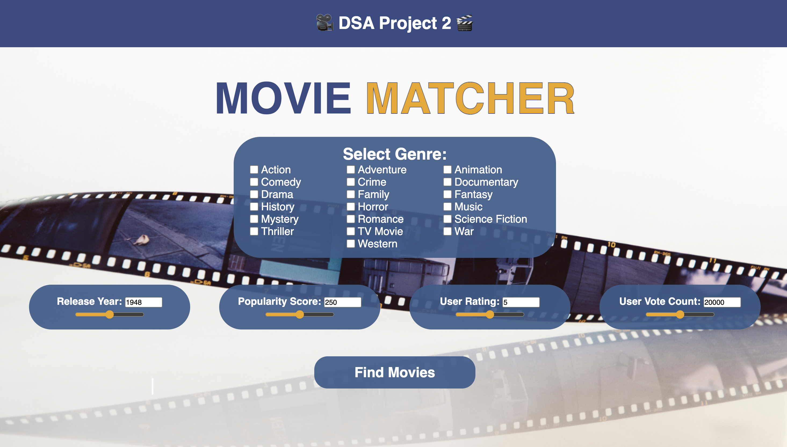
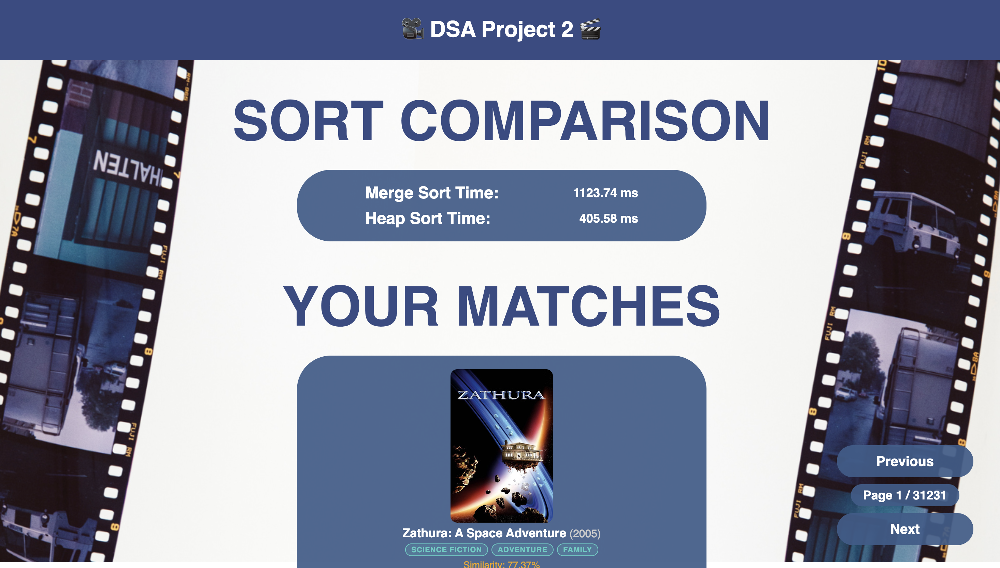

# Movie Matcher
---

A C++ web application that recommends movies based on your preferences using a weighted similarity scoring algorithm. Built with the [Crow](https://crowcpp.org/) web framework and data sourced from the [TMDB API](https://www.themoviedb.org/documentation/api).

## Features
---

- **Similarity matching** — scores every movie in the dataset against your preferences across five weighted criteria
- **Algorithm Comparison** — runs both merge sort and heap sort on the same data and displays the time each took, verifying that both produce identical results
- **Paginated results** — browse all matches 25 at a time
- **TMDB data** — dataset of movies from 1870–2026, fetched per genre and language and stored via Git LFS

### Input Screen
---

**Genre selection** — a checkbox grid lets you pick one or more genres (e.g. Action, Comedy, Horror). You can mix genres freely, so a movie that matches two of your three selected genres will still score higher than one that matches none.

**Preference sliders** — four sliders let you dial in exactly the kind of movie you want:

| Slider | Range | What it means |
|---|---|---|
| Release Year | 1870 – 2026 | The year the movie was released |
| Popularity Score | 0 – 500 | How widely seen the movie was at release (TMDB popularity index) |
| User Rating | 0 – 10 | Average audience score on TMDB |
| User Vote Count | 0 – 40,000 | How many people voted |

Each slider is paired with a number input so you can type an exact value instead of dragging.

Once you're happy with your selections, click **Find Movies**. The backend scores every movie in the dataset, sorts the results with both algorithms, and returns your top matches.




### Results Screen
---

After submitting, the page transitions to the results view.

**Sort comparison panel** — two timers at the top show how long each algorithm took to rank the full dataset. Both merge sort and heap sort run on every submission, and the backend verifies they produce identical rankings before returning anything.

**Movie cards** — each result card shows the movie's poster, title, release year, genres, a brief overview, and its similarity score. Cards are ordered from highest to lowest match.

**Pagination** — results are paged at 25 per page. Use the Previous / Next buttons to browse deeper into the ranked list without re-running the sort. The page indicator shows your current position.

Click **Back** to return to the input screen and adjust your preferences.




## Similarity Algorithm
---

Each movie receives a score in `[0, 1]` computed as a weighted sum:

| Criterion     | Weight | Method                                                                 |
|---------------|--------|------------------------------------------------------------------------|
| Genre         | 35%    | Jaccard similarity — genre intersection / genre union                  |
| Rating        | 25%    | Linear distance — score drops to 0 at 10 points apart                 |
| Release Year  | 20%    | Linear distance — score drops to 0 at 10+ years apart                 |
| Popularity    | 12%    | Log₁₀ scale — normalized against max popularity in the dataset (472.9)|
| Vote Count    | 8%     | Log₁₀ scale — normalized against max vote count in the dataset (39135)|

---

## Tech Stack
---

| Layer      | Technology                                      |
|------------|-------------------------------------------------|
| Language   | C++17                                           |
| Web server | [Crow v1.3.1](https://github.com/CrowCpp/Crow) |
| Networking | [Asio 1.38.0](https://think-async.com/Asio/)   |
| Data       | TMDB API + `movies.json` (Git LFS)             |
| Build      | CMake 3.28+                                     |
| Frontend   | Vanilla HTML / CSS / JavaScript                 |

---


## Getting Started
---

### Prerequisites
---

- CMake 3.28 or later
- A C++17-compatible compiler (GCC 9+, Clang 10+, MSVC 2019+)
- Git LFS (to pull `movies.json`)

### Build
---

```bash
git lfs pull          # download movies.json
mkdir build && cd build
cmake ..
cmake --build .
```

### Run

```bash
./Movie-Matcher
```

The server starts on **http://localhost:8080**.

---
